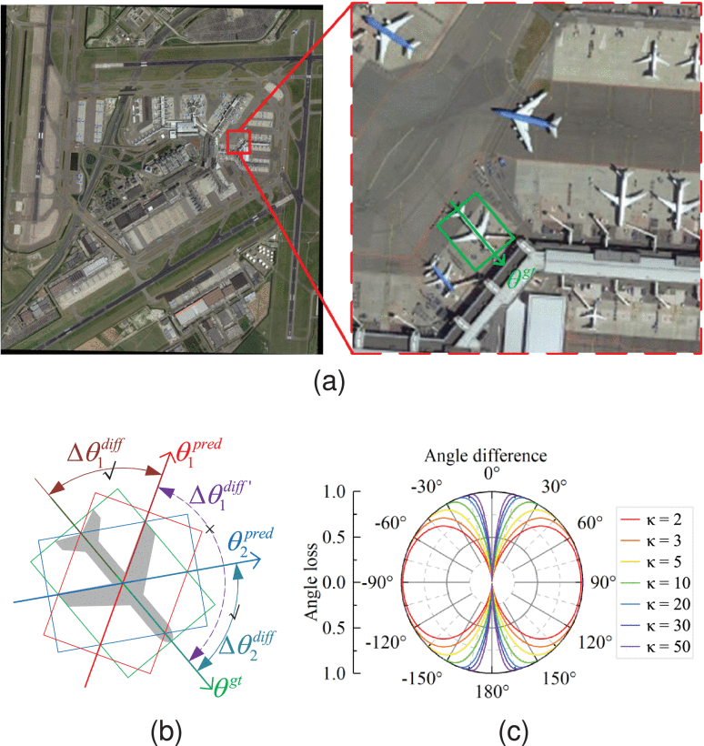

# [ABFL: Angular Boundary Discontinuity Free Loss for Arbitrary Oriented Object Detection in Aerial Images](https://ieeexplore.ieee.org/document/10443855)

> Zifei Zhao, Shengyang Li

## Introduction



Arbitrary oriented object detection (AOOD) in aerial images is a widely concerned and highly challenging task and plays an important role in many scenarios. The core of AOOD involves the representation, encoding, and feature augmentation of oriented bounding boxes (Bboxes). Existing methods lack intuitive modeling of angle difference measurement in oriented Bbox representations. Oriented Bboxes under different representations exhibit rotational symmetry with varying periods due to angle periodicity. The angular boundary discontinuity (ABD) problem at periodic boundary positions is caused by rotational symmetry in measuring angular differences. In addition, existing methods also use additional encoding–decoding structures for oriented Bboxes. In this article, we design an angular boundary discontinuity free loss (ABFL) based on the von Mises distribution. The ABFL aims to solve the ABD problem when detecting oriented objects. Specifically, ABFL proposes to treat angles as circular data rather than linear data when measuring angle differences, aiming to introduce angle periodicity to alleviate the ABD problem and improve the accuracy of angle difference measurement. In addition, ABFL provides a simple and effective solution for various periodic boundary discontinuities caused by rotational symmetry in AOOD tasks, as it does not require additional encoding–decoding structures for oriented Bboxes. Extensive experiments on the DOTA and HRSC2016 datasets show that the proposed ABFL loss outperforms some state-of-the-art (SOTA) methods focused on addressing the ABD problem.

## Citation

```
@InProceedings{ABFL_2024_TGRS,
  author = {Zhao, Zifei and Li, Shengyang},
  title = {ABFL: Angular Boundary Discontinuity Free Loss for Arbitrary Oriented Object Detection in Aerial Images},
  booktitle = {IEEE Transactions on Geoscience and Remote Sensing},
  month = {February},
  year = {2024},
  pages = {1-13} }
```
