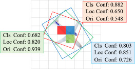

# [OASL: Orientation-aware adaptive sampling learning for arbitrary oriented object detection](https://www.sciencedirect.com/science/article/pii/S1569843224000943)

> Zifei Zhao, Shengyang Li

## Introduction



Arbitrary oriented object detection (AOOD) is a fundamental task in aeiral image interpretation, which is commonly implemented by optimizing three subtasks: classification, localization, and orientation. The consistency of classification, localization, and orientation is crucial for achieving high performance of AOOD detectors. However, independent prediction between subtasks and differences in quality metrics for task-specific samples reduces the accuracy of high-precision detection. In this paper, we propose a novel dense anchor-free detector Orientation-aware Adaptive Sampling Learning (OASL) that includes two core modules: Orientation-aware Structured Information Extraction Module (O-SIEM) and Weights adaptive Sample Information Richness Metric (W-SIRM). Specifically, O-SIEM applies the global and local receptive fields of objects to explicitly extract spatial contextual features of oriented and densely distributed objects, which helps to strike a balance between capturing task-interactive and task-specific features, ultimately leading to learning common patterns between subtasks. W-SIRM integrates information from three subtasks and achieves dynamic evaluation of sample quality and adaptive adjustment of sample weights based on the information richness of samples. Extensive experiments demonstrate that the proposed OASL method can effectively handle the consistency problem and enhance the validity of the sample quality metric.


## Citation

```
@InProceedings{OASL_2024_JAG,
  author = {Zhao, Zifei and Li, Shengyang},
  title = {OASL: Orientation-aware adaptive sampling learning for arbitrary oriented object detection},
  booktitle = {International Journal of Applied Earth Observation and Geoinformation},
  month = {April},
  year = {2024} }
```